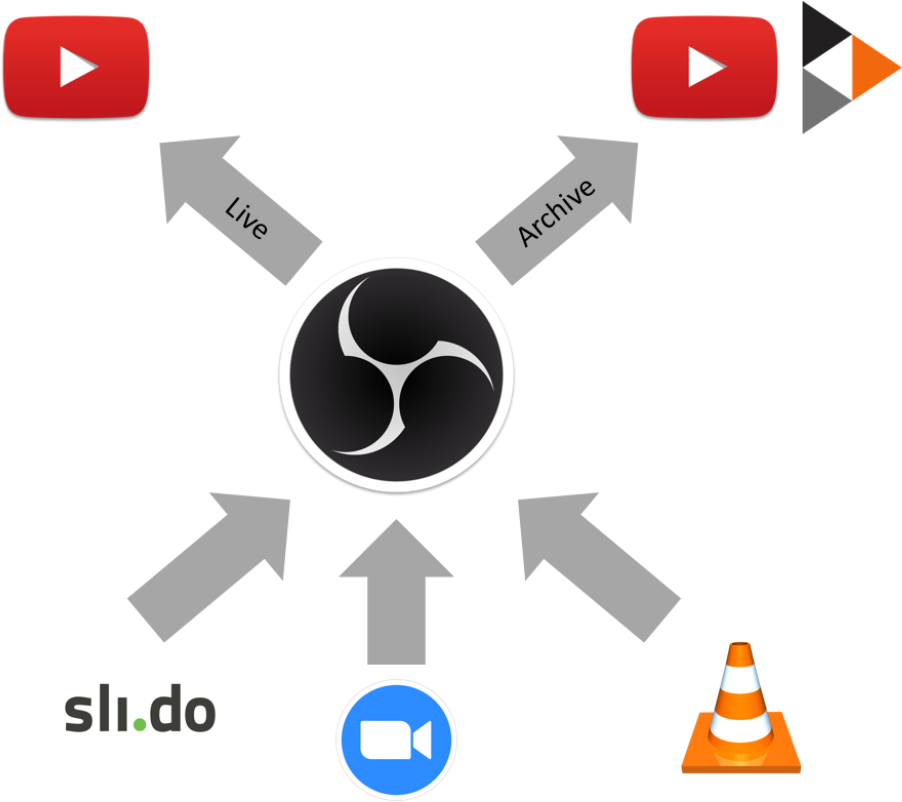

# The foss-north Setup

This page describes the virtual conference setup of foss-north. This was deployed during [foss-north 2020](https://foss-north.se/2020).

The foss-north was conducted as a live event with QA after each talk, but all sessions where also published for non-live consumption after the event.

# The Live Setup

The live setup is illustrated in the figure below:

The setup consists of the following services:

Service | Web site | Usage
--------------------------
 Zoom | https://zoom.us | Video conferencing system for live talks
 sli.do | https://sli.do | QA system
 VLC | https://www.videolan.org/vlc/ | Media player for pre-recorded talks
 OBS | https://obsproject.com/ | Broadcasting and recording program
 YouTube | https://youtube.com | Video streaming and hosting service
 ConfTube | https://conf.tube | Video hosting service

